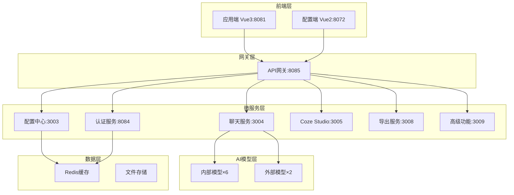

# 🚀 QMS-AI 智能质量管理系统

<div align="center">


[](LICENSE)
[](https://nodejs.org/)
[](https://vuejs.org/)
[](README.md#ai-models)

**配置驱动的企业级AI质量管理平台**

[🚀 快速开始](#quick-start) • [📖 文档](#documentation) • [🤖 AI模型](#ai-models) • [🛠️ 部署](#deployment) • [🤝 贡献](#contributing)

</div>

---

## 📋 项目概览

QMS-AI是一个现代化的智能质量管理系统，采用**配置驱动架构**，集成**8个主流AI模型**，提供企业级的质量管理解决方案。系统支持多角色权限管理、实时协作、智能分析等功能。

### ✨ 核心特性

- 🤖 **8个AI模型集成** - GPT-4o、Claude、Gemini等主流模型
- 🎛️ **配置驱动架构** - 配置端→应用端完整链路
- 🔐 **企业级认证** - 多角色权限管理，支持飞书集成
- 📱 **双技术栈前端** - Vue2配置端 + Vue3应用端
- 🔧 **微服务架构** - 9个微服务，高可用设计
- 🛠️ **完整工具链** - 问题诊断、性能监控、自动部署
- 📊 **实时监控** - Prometheus + Grafana监控体系
- 🚀 **一键部署** - Docker容器化，支持阿里云部署

---

## 🏗️ 系统架构

### 🌐 服务拓扑



### 📊 技术栈

| 层级 | 技术选型 | 版本 | 说明 |
|------|----------|------|------|
| **前端** | Vue 3 + Vite | 3.4+ | 应用端，现代化UI |
| | Vue 2 + Vue CLI | 2.7+ | 配置端，企业级管理 |
| | Element UI/Plus | Latest | 组件库 |
| **后端** | Node.js + Express | 18+ | 微服务架构 |
| | WebSocket | Latest | 实时通信 |
| | Redis | 7+ | 缓存和会话 |
| **AI集成** | 多模型API | Latest | 8个主流AI模型 |
| **监控** | Prometheus + Grafana | Latest | 性能监控 |
| **部署** | Docker + Docker Compose | Latest | 容器化部署 |

---

## 🤖 AI模型支持 {#ai-models}

### 内部模型 (通过传音代理)
| 模型 | 推理能力 | 工具调用 | 图文识别 | 状态 |
|------|----------|----------|----------|------|
| **GPT-4o** | ❌ | ✅ | ✅ | 🟢 正常 |
| **O3** | ✅ | ✅ | ❌ | 🟢 正常 |
| **Gemini 2.5 Pro Thinking** | ✅ | ✅ | ❌ | 🟢 正常 |
| **Claude 3.7 Sonnet** | ❌ | ✅ | ❌ | 🟢 正常 |
| **Qwen 2.5 Max** | ❌ | ✅ | ❌ | 🟢 正常 |
| **VoiceOne** | ❌ | ❌ | ❌ | 🟢 正常 |

### 外部模型 (直连)
| 模型 | 推理能力 | 工具调用 | 图文识别 | 状态 |
|------|----------|----------|----------|------|
| **DeepSeek V3** | ✅ | ✅ | ❌ | 🟢 正常 |
| **DeepSeek R1** | ✅ | ❌ | ❌ | 🟢 正常 |

---

## 🚀 快速开始 {#quick-start}

### 📋 环境要求

- **Node.js** >= 18.0.0
- **pnpm** >= 8.0.0  
- **Redis** >= 7.0
- **Git** >= 2.0

### ⚡ 一键启动

```bash
# 1. 克隆项目
git clone https://github.com/xinren1232/new-qms.git
cd new-qms

# 2. 安装依赖
pnpm install

# 3. 启动Redis (Windows)
.\QMS-START.bat

# 4. 启动所有服务
pnpm run dev
```

### 🌐 访问地址

| 服务 | 地址 | 说明 |
|------|------|------|
| **应用端** | http://localhost:8081 | 主要工作界面 |
| **配置端** | http://localhost:8072 | 系统配置管理 |
| **API网关** | http://localhost:8085 | API统一入口 |
| **监控面板** | http://localhost:3000 | Grafana监控 |

### 🔧 开发模式

```bash
# 启动后端服务
pnpm run dev:backend

# 启动前端应用
pnpm run dev:frontend

# 启动特定服务
pnpm run chat-service      # 聊天服务
pnpm run config-service    # 配置中心
pnpm run auth-service      # 认证服务
```

---

## 📁 项目结构

```
qms-ai/
├── 📁 backend/nodejs/           # 🔧 后端微服务
│   ├── api-gateway.js          # API网关
│   ├── chat-service.js         # 聊天服务
│   ├── auth-service.js         # 认证服务
│   ├── config-center-service.js # 配置中心
│   └── services/               # 其他微服务
├── 📁 frontend/                # 🎨 前端应用
│   ├── 应用端/                 # Vue3 应用端
│   └── 配置端/                 # Vue2 配置端
├── 📁 config/                  # ⚙️ 配置文件
│   ├── docker-compose.yml     # Docker编排
│   ├── nginx/                 # Nginx配置
│   └── redis/                 # Redis配置
├── 📁 monitoring/              # 📊 监控配置
│   ├── prometheus/            # Prometheus配置
│   └── grafana/               # Grafana仪表板
├── 📁 scripts/                 # 🛠️ 工具脚本
├── 📁 docs/                    # 📖 文档
└── 📁 tools/                   # 🔨 部署工具
```

---

## 🛠️ 部署指南 {#deployment}

### 🐳 Docker部署

```bash
# 构建并启动所有服务
docker-compose up -d

# 查看服务状态
docker-compose ps

# 查看日志
docker-compose logs -f
```

### ☁️ 阿里云部署

```bash
# 使用部署脚本
.\tools\deployment\deploy-aliyun-windows.ps1

# 或手动部署
.\QMS-AI-Complete-Deploy.bat
```

### 🔍 健康检查

```bash
# 检查所有服务状态
pnpm run health

# 检查特定服务
curl http://localhost:8085/health
```

---

## 📖 文档 {#documentation}

- 📚 [快速启动指南](QUICK-START-GUIDE.md)
- 🔧 [系统配置文档](docs/)
- 🤖 [AI模型集成指南](docs/ai-integration.md)
- 🚀 [部署运维手册](docs/deployment.md)
- 🛠️ [开发者指南](docs/development.md)
- 📊 [监控运维指南](docs/monitoring.md)

---

## 🤝 贡献指南 {#contributing}

我们欢迎所有形式的贡献！

### 🔄 贡献流程

1. **Fork** 本仓库
2. **创建** 功能分支 (`git checkout -b feature/AmazingFeature`)
3. **提交** 更改 (`git commit -m 'Add some AmazingFeature'`)
4. **推送** 到分支 (`git push origin feature/AmazingFeature`)
5. **创建** Pull Request

### 📝 开发规范

- 遵循 [ESLint](https://eslint.org/) 代码规范
- 提交信息使用 [Conventional Commits](https://conventionalcommits.org/)
- 添加适当的测试用例
- 更新相关文档

### 🐛 问题反馈

- [报告Bug](https://github.com/xinren1232/new-qms/issues/new?template=bug_report.md)
- [功能请求](https://github.com/xinren1232/new-qms/issues/new?template=feature_request.md)
- [讨论交流](https://github.com/xinren1232/new-qms/discussions)

---

## 📊 项目状态


### 🏆 里程碑

- ✅ **v1.0** - 基础AI聊天功能
- ✅ **v2.0** - 微服务架构重构
- ✅ **v2.1** - 8个AI模型集成
- 🚧 **v3.0** - 企业级功能增强 (开发中)

---

## 📄 许可证

本项目采用 [MIT License](LICENSE) 开源协议。

---

## 🙏 致谢

感谢所有为这个项目做出贡献的开发者！

<div align="center">

**⭐ 如果这个项目对您有帮助，请给我们一个Star！**

Made with ❤️ by QMS-AI Team

</div>
