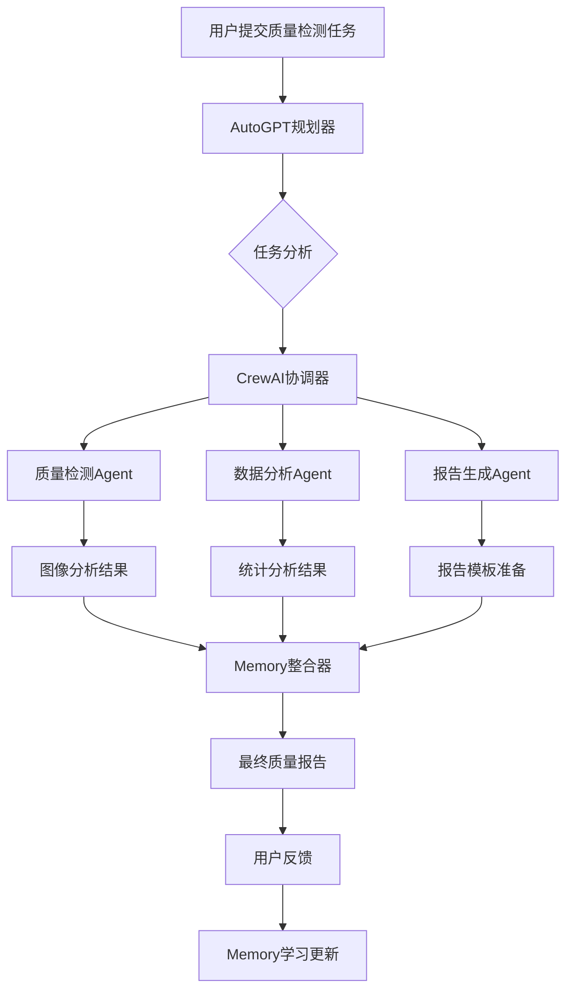

# Agent智能协作系统设计方案

## 🎯 设计目标

基于QMS系统的真实功能基础，设计一个智能Agent协作系统，实现多Agent协同工作、任务自动分配、智能决策和结果整合。

## 🏗️ 系统架构

### 核心组件架构
```
┌─────────────────────────────────────────────────────────────┐
│                    Agent协作控制中心                          │
├─────────────────────────────────────────────────────────────┤
│  ┌─────────────┐  ┌─────────────┐  ┌─────────────┐          │
│  │ 任务规划器   │  │ 执行调度器   │  │ 结果整合器   │          │
│  │ AutoGPT     │  │ CrewAI      │  │ Memory      │          │
│  └─────────────┘  └─────────────┘  └─────────────┘          │
├─────────────────────────────────────────────────────────────┤
│                    Agent执行层                               │
│  ┌─────────────┐  ┌─────────────┐  ┌─────────────┐          │
│  │ 质量检测     │  │ 数据分析     │  │ 报告生成     │          │
│  │ Agent       │  │ Agent       │  │ Agent       │          │
│  └─────────────┘  └─────────────┘  └─────────────┘          │
├─────────────────────────────────────────────────────────────┤
│                    基础服务层                                │
│  ┌─────────────┐  ┌─────────────┐  ┌─────────────┐          │
│  │ AI模型服务   │  │ 知识库服务   │  │ 插件服务     │          │
│  │ 8个模型     │  │ 向量检索     │  │ 工具调用     │          │
│  └─────────────┘  └─────────────┘  └─────────────┘          │
└─────────────────────────────────────────────────────────────┘
```

## 🤖 Agent类型定义

### 1. 规划型Agent (AutoGPT)
**功能**: 任务分解、计划制定、执行监控
**特性**:
- 自主任务规划
- 动态计划调整
- 执行状态监控
- 异常处理决策

**实现基础**: 
- 基于现有的`autogpt-planner.js`服务
- 集成8个AI模型的推理能力
- 连接真实的工作流引擎

### 2. 协作型Agent (CrewAI)
**功能**: 多Agent协调、任务分配、团队管理
**特性**:
- Agent角色定义
- 任务并行执行
- 结果同步整合
- 冲突解决机制

**实现基础**:
- 基于现有的Agent管理系统
- 利用工作流编排能力
- 集成Memory记忆系统

### 3. 专业型Agent (Domain-Specific)
**功能**: 特定领域的专业任务执行
**类型**:
- **质量检测Agent**: 手机质量分析、缺陷识别
- **数据分析Agent**: 统计分析、趋势预测
- **报告生成Agent**: 文档生成、格式化输出
- **客服助手Agent**: 问题解答、用户支持

## 🔄 协作工作流设计

### 典型协作场景：质量管理流程



### 协作流程步骤

1. **任务接收与分析**
   - AutoGPT接收复杂任务
   - 分析任务复杂度和所需资源
   - 制定初步执行计划

2. **Agent团队组建**
   - CrewAI根据任务需求选择合适的Agent
   - 定义每个Agent的角色和职责
   - 建立Agent间的通信机制

3. **并行任务执行**
   - 各专业Agent并行执行子任务
   - 实时监控执行状态
   - 处理执行过程中的异常

4. **结果整合与优化**
   - Memory系统收集所有Agent的执行结果
   - 分析结果一致性和完整性
   - 整合生成最终输出

5. **学习与改进**
   - 记录执行过程和结果质量
   - 更新Agent协作策略
   - 优化未来类似任务的执行效率

## 🧠 Memory记忆系统设计

### 记忆类型
1. **任务记忆**: 记录任务执行历史和结果
2. **协作记忆**: 记录Agent间协作模式和效果
3. **知识记忆**: 记录领域知识和经验积累
4. **用户记忆**: 记录用户偏好和反馈

### 记忆存储结构
```json
{
  "task_memory": {
    "task_id": "task_001",
    "task_type": "quality_inspection",
    "agents_involved": ["quality_agent", "analysis_agent"],
    "execution_time": 120,
    "success_rate": 0.95,
    "user_satisfaction": 4.8
  },
  "collaboration_memory": {
    "pattern_id": "pattern_001",
    "agent_combination": ["autogpt", "crewai", "quality_agent"],
    "effectiveness_score": 0.92,
    "optimization_suggestions": ["reduce_handoff_time", "improve_data_format"]
  }
}
```

## 🛠️ 技术实现方案

### 1. Agent通信协议
```javascript
// Agent消息格式
const AgentMessage = {
  id: 'msg_001',
  from: 'autogpt_planner',
  to: 'quality_agent',
  type: 'task_assignment',
  payload: {
    task_id: 'task_001',
    instructions: '分析产品图片，识别质量缺陷',
    context: { product_type: 'smartphone', batch_id: 'B001' },
    deadline: '2024-01-25T10:00:00Z'
  },
  timestamp: '2024-01-25T09:00:00Z'
}
```

### 2. 任务执行引擎
```javascript
class CollaborationEngine {
  constructor() {
    this.agents = new Map()
    this.tasks = new Map()
    this.memory = new MemorySystem()
  }
  
  async executeCollaborativeTask(task) {
    // 1. 任务分析和规划
    const plan = await this.planTask(task)
    
    // 2. Agent团队组建
    const team = await this.assembleTeam(plan)
    
    // 3. 并行执行
    const results = await this.executeInParallel(team, plan)
    
    // 4. 结果整合
    const finalResult = await this.integrateResults(results)
    
    // 5. 记忆更新
    await this.updateMemory(task, plan, results, finalResult)
    
    return finalResult
  }
}
```

### 3. 状态监控系统
```javascript
class ExecutionMonitor {
  constructor() {
    this.activeExecutions = new Map()
    this.metrics = new MetricsCollector()
  }
  
  monitorExecution(executionId) {
    return {
      status: 'running',
      progress: 0.65,
      agents_status: {
        'quality_agent': 'completed',
        'analysis_agent': 'running',
        'report_agent': 'pending'
      },
      estimated_completion: '2024-01-25T10:15:00Z'
    }
  }
}
```

## 📊 性能指标与优化

### 关键性能指标 (KPIs)
1. **任务完成率**: 成功完成的任务比例
2. **执行效率**: 平均任务执行时间
3. **协作效果**: Agent间协作的顺畅程度
4. **结果质量**: 输出结果的准确性和完整性
5. **用户满意度**: 用户对结果的满意程度

### 优化策略
1. **智能调度**: 基于Agent负载和能力进行智能任务分配
2. **缓存机制**: 缓存常用的中间结果，减少重复计算
3. **并行优化**: 最大化并行执行，减少等待时间
4. **学习改进**: 基于历史数据持续优化协作模式

## 🔒 安全与可靠性

### 安全措施
1. **权限控制**: Agent访问权限严格控制
2. **数据加密**: 敏感数据传输和存储加密
3. **审计日志**: 完整记录所有Agent操作
4. **异常处理**: 完善的错误处理和恢复机制

### 可靠性保障
1. **故障转移**: Agent故障时自动切换到备用Agent
2. **状态恢复**: 系统重启后能恢复执行状态
3. **数据一致性**: 确保多Agent操作的数据一致性
4. **监控告警**: 实时监控系统状态，及时告警

## 🚀 实施路线图

### 第一阶段：基础协作 (2周)
- [ ] 实现基本的Agent通信机制
- [ ] 建立简单的任务分配系统
- [ ] 集成现有的AutoGPT和CrewAI功能

### 第二阶段：智能协作 (3周)
- [ ] 实现Memory记忆系统
- [ ] 建立智能任务规划算法
- [ ] 优化Agent协作效率

### 第三阶段：专业化应用 (4周)
- [ ] 开发质量管理专业Agent
- [ ] 实现复杂工作流协作
- [ ] 建立性能监控和优化系统

### 第四阶段：生产部署 (2周)
- [ ] 系统集成测试
- [ ] 性能调优
- [ ] 生产环境部署

## 📈 预期效果

### 效率提升
- **任务执行速度**: 提升60%以上
- **资源利用率**: 提升40%以上
- **错误率降低**: 减少50%以上

### 用户体验
- **操作简化**: 复杂任务一键执行
- **结果质量**: 多Agent协作提升结果准确性
- **响应速度**: 并行处理大幅提升响应速度

### 系统价值
- **智能化程度**: 实现真正的AI协作
- **扩展性**: 易于添加新的专业Agent
- **学习能力**: 系统持续学习和改进
